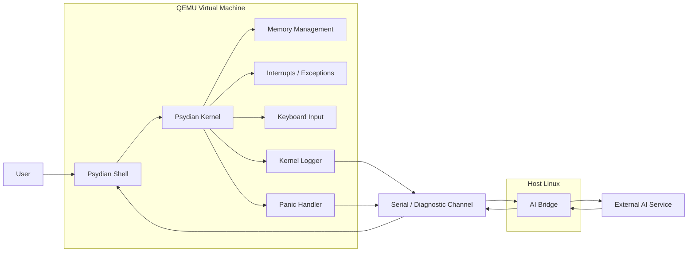

# High-Level Design (HLD)

## Architecture

## Components

| Component | Responsibility |
|---|---|
| Psydian Kernel | Provides the core operating-system functionality, including boot initialization, memory management, paging, interrupt and exception handling, keyboard input, logging, panic handling, and low-level system services. |
| Psydian Shell | Provides the primary user interaction interface. It accepts keyboard input, parses commands, executes supported built-in commands, maintains command history, provides basic auto-completion, and displays AI-assisted responses. |
| Memory Management | Manages the kernel's memory-related functionality, including paging, virtual-memory configuration, heap initialization, and dynamic memory allocation required by the MVP. |
| Interrupt / Exception Handling | Handles CPU exceptions and hardware interrupts required by the operating-system prototype, including keyboard and timer-related events. |
| Keyboard Input | Receives keyboard events and converts them into input that can be consumed by the shell. |
| Kernel Logger | Records kernel events, status messages, errors, and diagnostic information through the defined logging/output mechanism. |
| Panic Handler | Handles unrecoverable kernel failures, records relevant diagnostic information, and places the kernel into a controlled panic state. |
| Diagnostic Boundary | Converts selected kernel logs and failure information into a defined, structured form that can be safely transferred outside the kernel. |
| Serial / Diagnostic Channel | Provides the communication path between the Psydian environment running in QEMU and the host-side AI Bridge. |
| AI Bridge | Runs outside the kernel on the host system. It receives user requests or diagnostic information, processes the data, communicates with the external AI service, validates responses, and sends the result back to Psydian. |
| External AI Service | An external large language model service that analyzes user requests and structured system diagnostics and produces explanations, command suggestions, or safe recovery guidance. |
| Voice Layer | Optional input/output layer that provides speech-to-text and text-to-speech functionality while using the same shell and AI processing pipeline. |
| QEMU | Provides the virtual x86_64 hardware environment used to boot, execute, test, and debug Psydian during development. |

## End-to-End Data Flow

### 1. Normal Command Execution

1. User enters a command through the Psydian Shell.
2. The Shell receives the keyboard input and builds the command buffer.
3. The Shell parses the command and its arguments.
4. The Shell validates the command against the supported command set.
5. The appropriate kernel functionality is invoked.
6. The Psydian Kernel performs the requested operation using the relevant subsystem.
7. The kernel returns the operation result or a controlled error.
8. The Shell formats and displays the result to the user.

### 2. AI-Assisted User Request

1. User enters an AI-assisted request through the Psydian Shell.
2. The Shell identifies the request as requiring AI assistance.
3. The request is converted into a structured message.
4. The structured message is transferred through the defined serial / diagnostic communication channel.
5. The host-side AI Bridge receives and parses the message.
6. The AI Bridge builds a request containing the user's query and relevant system context.
7. The AI Bridge sends the request to the configured external AI service through the host system's normal network connection.
8. The external AI service analyzes the request and generates a response.
9. The AI Bridge receives and validates the AI response.
10. The validated response is converted into the communication format expected by Psydian.
11. The response is transferred back through the serial / diagnostic communication channel.
12. The Psydian Shell receives and displays the AI explanation, suggestion, or recommended action to the user.
13. If the suggested action is privileged or destructive, the Shell requires explicit user confirmation before execution.

### 3. Kernel Panic and AI-Assisted Diagnostics

1. A controlled kernel failure is triggered during testing.
2. The Panic Handler detects the failure and captures the available diagnostic information.
3. The Kernel Logger records the panic event.
4. The diagnostic system creates a structured diagnostic record containing relevant information such as event type, severity, message, source, and available context.
5. The diagnostic record is transmitted through the defined serial / diagnostic communication channel.
6. The host-side AI Bridge receives and parses the diagnostic record.
7. The AI Bridge constructs a structured diagnostic-analysis request.
8. The request is sent to the external AI service.
9. The AI service analyzes the diagnostic information and generates an explanation, probable cause, and recommended recovery steps when sufficient information is available.
10. The AI Bridge validates the returned response.
11. The response is transmitted back to the Psydian environment.
12. The Shell or diagnostic interface displays the analysis to the user.
13. The user reviews the recommended action and decides whether to perform any suggested recovery operation.

### 4. Voice Interaction (Optional)

1. User provides a voice command.
2. The Voice Layer performs speech-to-text conversion.
3. The resulting text is passed to the existing Shell input pipeline.
4. The Shell parses and validates the recognized command or identifies it as an AI-assisted request.
5. The request follows the normal command or AI-assisted data flow.
6. The resulting response is returned to the Shell.
7. The Voice Layer converts the response to speech when text-to-speech is enabled.
8. The user receives the result through the selected voice or text interface.

## Scalability

Psydian is designed as a modular operating-system prototype, so its primary scalability concern is architectural extensibility rather than supporting a large number of concurrent users. The kernel, shell, diagnostic system, and AI Bridge maintain clear responsibilities and interfaces so that new operating-system capabilities can be added without requiring a complete redesign.

The kernel can be extended in future versions with additional subsystems such as process scheduling, filesystem support, networking, device drivers, and advanced resource management. User and permission management can also be introduced in future versions if multi-user operation becomes a project requirement.

The AI Bridge is separated from the kernel so that different AI providers, local models, and additional AI capabilities can be integrated independently. As AI workload increases, the bridge could be extended with asynchronous processing, request queues, and worker components.

The initial 8-week implementation will prioritize a small and reliable architecture. Load-balancing infrastructure or distributed server scaling is not required because Psydian is a locally executed operating-system prototype rather than a multi-user web service.

## Reliability

Psydian will be designed so that failure of one subsystem does not unnecessarily cause failure of unrelated components. The kernel will remain independent from external AI services, and the AI assistance layer will be treated as an optional enhancement rather than a dependency for basic operating-system operation.

- The kernel shall boot and initialize consistently in the defined QEMU environment.
- Kernel initialization failures shall enter a controlled diagnostic state rather than failing silently.
- Interrupts and CPU exceptions shall be handled through defined handlers where supported by the MVP.
- Unrecoverable kernel failures shall invoke the panic handler and produce diagnostic information.
- Kernel logging shall provide sufficient information to identify the source and type of defined failures.
- A controlled panic mechanism shall be used during testing to verify predictable failure behavior.
- Memory-management failures shall be detected and handled without causing uncontrolled behavior wherever possible.
- Unknown or malformed shell commands shall generate controlled errors while keeping the shell operational.
- The AI Bridge shall use request timeouts so that an unavailable AI service does not block the system indefinitely.
- Temporary AI-service or network failures shall be reported to the user and shall not prevent normal shell and kernel operation.
- Malformed or unexpected AI responses shall be rejected or treated as untrusted data rather than executed automatically.
- Failure of the serial or diagnostic communication channel shall not directly cause kernel instability.
- Voice-service failure, when voice functionality is enabled, shall fall back to normal text-based interaction.
- Core operating-system functionality shall remain available even when AI, voice, network, or other optional services are unavailable.
- Reliability shall be evaluated using controlled failure scenarios, including kernel panics, invalid commands, AI-service failures, timeouts, malformed responses, and communication failures.

## Security

Psydian will use a security architecture that keeps the privileged operating-system kernel separate from the external AI assistance layer. The kernel is treated as a trusted and security-critical component, while the AI Bridge and external AI service are considered outside the kernel trust boundary. AI-generated information will never be treated as inherently trusted or allowed to directly modify kernel memory.

- The Psydian Kernel shall remain isolated from the external AI service.
- The AI Bridge shall operate outside the kernel's privileged execution environment.
- The external AI service shall not have direct access to kernel memory, kernel data structures, or privileged hardware operations.
- Communication between Psydian and the AI Bridge shall use a defined and controlled interface.
- Only required diagnostic information shall be exposed through the diagnostic boundary.
- AI-generated responses shall be treated as untrusted input.
- AI-generated commands shall pass through normal shell parsing and validation before any execution is considered.
- Privileged or potentially destructive operations shall require explicit user confirmation.
- The system shall not automatically execute arbitrary privileged commands generated by the AI.
- AI API credentials and other sensitive configuration data shall remain outside the kernel source code.
- The AI Bridge shall validate incoming and outgoing message formats to reduce malformed or unexpected input.
- Network communication with the external AI service shall be handled by the host-side AI Bridge rather than by the bare-metal kernel.
- Failure or compromise of the external AI service shall not directly compromise the kernel's core execution path.
- Voice input, when enabled, shall follow the same command validation and authorization rules as text input.
- Diagnostic data sent to external AI services shall be limited to information necessary for the requested analysis.