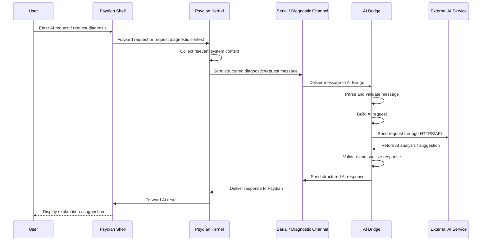
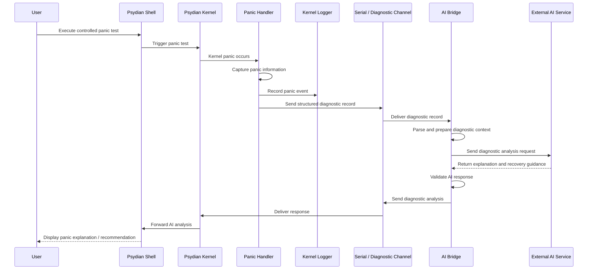
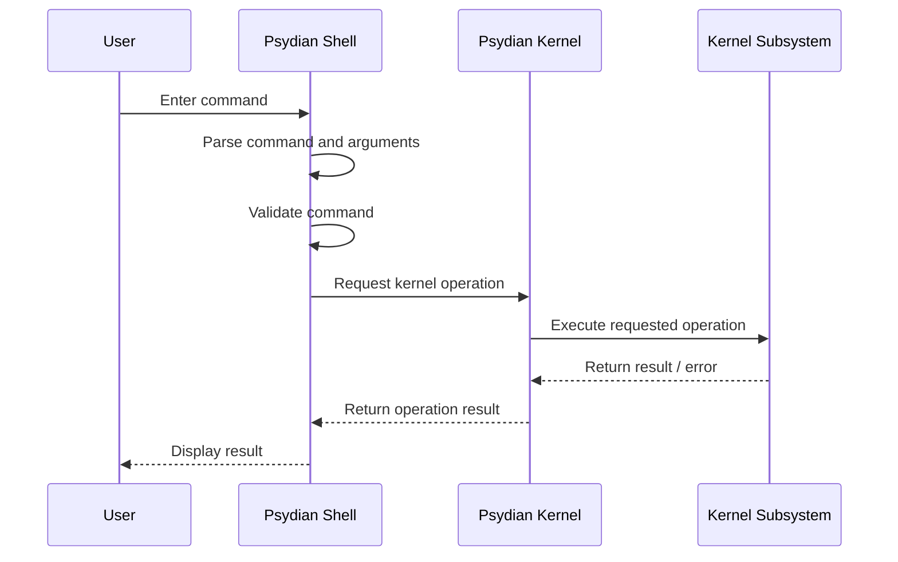
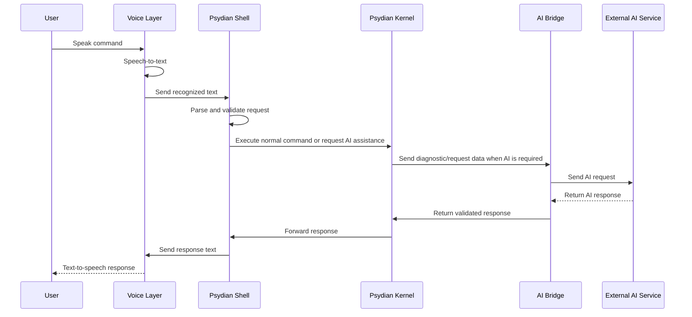

# Low-Level Design (LLD)

## Kernel Modules

```text
kernel/
├── src/
│   ├── main.rs
│   │
│   ├── boot/
│   │   └── mod.rs
│   │
│   ├── interrupts/
│   │   ├── mod.rs
│   │   ├── idt.rs
│   │   └── handlers.rs
│   │
│   ├── memory/
│   │   ├── mod.rs
│   │   ├── paging.rs
│   │   └── heap.rs
│   │
│   ├── allocator/
│   │   └── mod.rs
│   │
│   ├── input/
│   │   ├── mod.rs
│   │   └── keyboard.rs
│   │
│   ├── serial/
│   │   └── mod.rs
│   │
│   ├── logger/
│   │   └── mod.rs
│   │
│   ├── panic/
│   │   └── mod.rs
│   │
│   └── shell/
│       ├── mod.rs
│       ├── parser.rs
│       ├── commands.rs
│       ├── history.rs
│       └── autocomplete.rs
│
└── Cargo.toml
```


## AI Bridge Modules

```text
ai-bridge/
├── src/
│   ├── main.rs
│   │
│   ├── channel/
│   │   ├── mod.rs
│   │   ├── reader.rs
│   │   └── writer.rs
│   │
│   ├── protocol/
│   │   ├── mod.rs
│   │   ├── parser.rs
│   │   ├── message.rs
│   │   └── serializer.rs
│   │
│   ├── diagnostics/
│   │   ├── mod.rs
│   │   └── processor.rs
│   │
│   ├── ai/
│   │   ├── mod.rs
│   │   ├── client.rs
│   │   ├── prompt.rs
│   │   └── response.rs
│   │
│   ├── validation/
│   │   ├── mod.rs
│   │   └── validator.rs
│   │
│   └── config/
│       ├── mod.rs
│       └── settings.rs
│
└── Cargo.toml
```


### AI Bridge processing flow

The internal flow of the bridge is:

```text
Incoming Message
      ↓
Channel Reader
      ↓
Protocol Parser
      ↓
Message Type Detection
      ↓
      ├── Diagnostic
      │       ↓
      │   Diagnostic Processor
      │       ↓
      │   Prompt Builder
      │
      └── AI Request
              ↓
          Prompt Builder
              ↓
           AI Client
              ↓
        External AI Service
              ↓
         AI Response
              ↓
       Response Parser
              ↓
         Validator
              ↓
       Protocol Serializer
              ↓
        Channel Writer
              ↓
            QEMU
              ↓
       Psydian Shell
```


## Key Interfaces

### KernelInitializer

Responsible for coordinating the startup sequence of the Psydian kernel.

- `init_boot()`
- `init_serial()`
- `init_interrupts()`
- `init_memory()`
- `init_heap()`
- `init_input()`
- `start_shell()`

### MemoryManager

Responsible for initializing and managing memory resources required by the kernel.

- `init_paging()`
- `init_heap()`
- `allocate(size)`
- `deallocate(ptr, size)`

### InterruptManager

Responsible for configuring and handling CPU exceptions and hardware interrupts.

- `init_idt()`
- `register_handlers()`
- `handle_exception(frame)`
- `handle_interrupt()`

### KeyboardInput

Responsible for converting keyboard hardware events into shell input.

- `read_scancode()`
- `decode_key(scancode)`
- `push_input(key)`
- `read_input()`

### Logger

Responsible for recording kernel status, warning, error, and diagnostic events.

- `info(message)`
- `warn(message)`
- `error(message)`
- `log_diagnostic(record)`

### PanicHandler

Responsible for handling unrecoverable kernel failures and generating diagnostic information.

- `handle_panic(info)`
- `build_diagnostic()`
- `write_panic_log(record)`
- `halt()`

### Shell

Responsible for receiving user input, parsing commands, executing supported commands, and displaying results.

- `read_input()`
- `parse_command(input)`
- `execute(command)`
- `display_output(result)`
- `request_ai(input)`

### CommandRegistry

Responsible for maintaining the supported shell commands and mapping commands to their handlers.

- `register(command)`
- `find(name)`
- `execute(command, args)`
- `list_commands()`

### DiagnosticChannel

Responsible for transferring structured diagnostic and AI messages between the Psydian environment and the host-side AI Bridge.

- `send(message)`
- `receive()`
- `encode(message)`
- `decode(data)`

### ProtocolParser

Responsible for identifying and parsing messages exchanged between Psydian and the AI Bridge.

- `parse(data)`
- `validate_message(message)`
- `message_type(message)`
- `serialize(message)`

### DiagnosticProcessor

Responsible for extracting and preparing relevant kernel information for AI analysis.

- `parse_diagnostic(record)`
- `normalize_diagnostic(record)`
- `build_context(record)`

### AIClient

Responsible for communicating with the configured external AI service.

- `build_request(context)`
- `send_request(request)`
- `receive_response()`
- `parse_response(response)`

### PromptBuilder

Responsible for constructing structured AI requests from user queries and system diagnostics.

- `build_user_prompt(query)`
- `build_diagnostic_prompt(diagnostic)`
- `build_context(query, diagnostic)`

### ResponseValidator

Responsible for validating and filtering AI-generated responses before they are returned to Psydian.

- `validate(response)`
- `validate_command(command)`
- `check_confirmation_required(action)`
- `sanitize(response)`

### VoiceInterface

Responsible for optional voice input and output.

- `speech_to_text(audio)`
- `parse_voice_command(text)`
- `text_to_speech(response)`


## Sequence

### AI-Assisted Diagnostic Flow




### Controlled Kernel Panic Diagnostic Flow




### Normal Command Execution Flow




### Voice Interaction Flow (Optional)




## Design Patterns

- **Module-Based Architecture** — Kernel functionality is divided into independent modules such as memory management, interrupt handling, input, logging, panic handling, and shell processing. This keeps subsystem responsibilities separated and makes individual components easier to test and maintain.

- **Command Pattern** — The shell represents supported commands as executable command handlers. This allows the command parser and command execution logic to remain separated and makes it easier to add new built-in commands without modifying the overall shell flow.

- **Adapter Pattern** — The AI Bridge will isolate the external AI provider behind an internal AI client interface. This allows the underlying AI provider or API implementation to be replaced without changing the kernel-facing communication logic.

- **Producer–Consumer Pattern** — The diagnostic communication path can follow a producer–consumer model, where the Psydian kernel produces diagnostic messages and the host-side AI Bridge consumes them for processing. This keeps diagnostic generation independent from AI processing.

- **Separation of Concerns** — Kernel responsibilities, shell interaction, diagnostic processing, AI communication, and voice interaction are kept in separate components. This reduces coupling and prevents optional external services from becoming dependencies of core kernel functionality.

- **Defensive Boundary Pattern** — Data crossing from the kernel to the external AI layer is treated as controlled input, while AI responses are treated as untrusted data. Validation and explicit confirmation are applied before potentially privileged actions are considered.


## Validation

Psydian will validate data at each major system boundary before processing or execution. Validation will primarily focus on shell commands, diagnostic messages, communication protocol messages, AI requests, and AI-generated responses.

- Validate shell commands against the supported command set before execution.
- Validate command arguments and reject malformed or unsupported input.
- Validate diagnostic messages received from the kernel to ensure that the expected message type and required fields are present.
- Validate communication frames before passing their payload to the AI Bridge or shell.
- Validate AI requests before sending them to the external AI service.
- Validate AI responses to ensure that the expected response structure is present.
- Treat AI-generated commands as untrusted input and pass them through normal shell validation.
- Detect whether a suggested operation is privileged, destructive, or otherwise requires explicit user confirmation.
- Reject malformed, incomplete, or unexpected messages instead of attempting unsafe processing.
- Validate voice-transcribed text through the same shell and AI validation pipeline used for keyboard input.
- Validate configuration values used by the AI Bridge before starting external communication.


## Error Handling

Psydian will use controlled error handling at both kernel and host-side boundaries. Kernel failures must enter defined failure states, while failures in the AI Bridge, external AI service, communication channel, or voice layer must not destabilize the core operating-system functionality.

- Kernel initialization failures shall produce diagnostic information and enter a controlled failure state.
- CPU exceptions shall be routed to their defined exception handlers.
- Unrecoverable kernel failures shall invoke the panic handler.
- The panic handler shall record the available failure information before entering the controlled panic state.
- Memory-allocation failures shall return a controlled error or enter the appropriate kernel failure path.
- Invalid or unsupported shell commands shall return a user-readable error without terminating the shell.
- Malformed command arguments shall be rejected before execution.
- Invalid or incomplete diagnostic messages shall be rejected by the receiving component.
- Invalid communication frames shall not be processed as valid commands or diagnostics.
- AI Bridge communication failures shall return an error status instead of blocking the kernel indefinitely.
- AI service timeouts shall be handled using bounded request timeouts.
- External AI service failures shall be reported to the user while allowing normal shell and kernel operation to continue.
- Malformed AI responses shall be rejected or safely presented as untrusted information.
- AI-generated commands shall never bypass normal shell validation.
- Privileged or destructive actions shall not be executed automatically when generated by the AI.
- Serial or diagnostic-channel failures shall not directly cause kernel instability.
- Voice-processing failures shall fall back to normal keyboard/text interaction when voice functionality is enabled.
- User-facing errors shall provide useful information without exposing sensitive configuration data, credentials, or unnecessary internal implementation details.
- Errors in the AI Bridge shall be logged with sufficient contextual information for debugging while avoiding exposure of API credentials or other sensitive data.
- Where practical, internal errors shall use stable error categories or codes so that they can be identified consistently during testing and debugging.